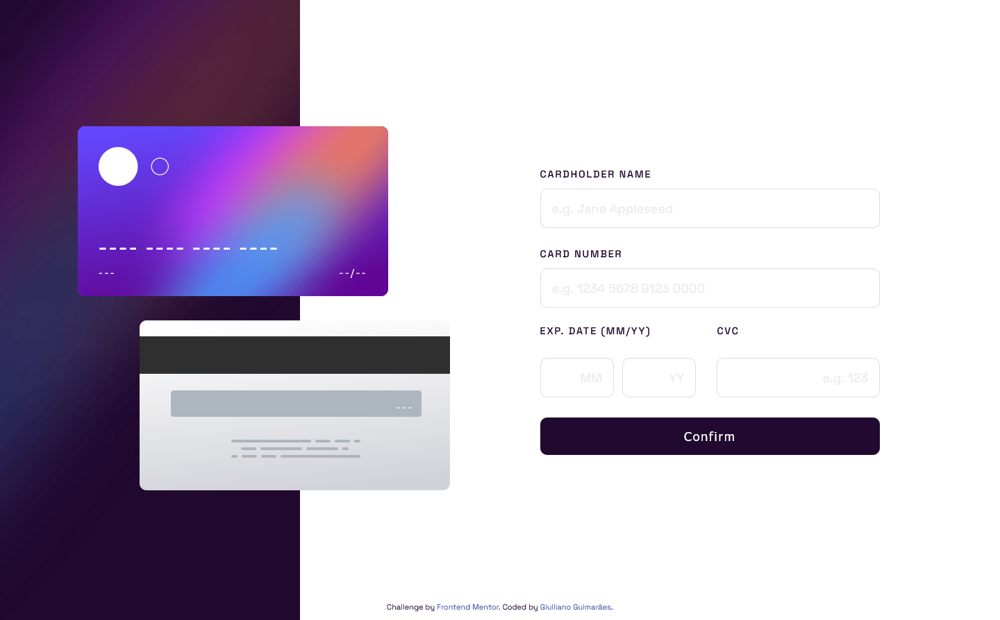

# Frontend Mentor - Interactive card details form solution

This is a solution to the [Interactive card details form challenge on Frontend Mentor](https://www.frontendmentor.io/challenges/interactive-card-details-form-XpS8cKZDWw). Frontend Mentor challenges help you improve your coding skills by building realistic projects. 

## Table of contents

- [Overview](#overview)
  - [The challenge](#the-challenge)
  - [Screenshot](#screenshot)
  - [Links](#links)
- [My process](#my-process)
  - [Built with](#built-with)
  - [Step by step of building](#step-by-step-of-building)
  - [What I learned](#what-i-learned)
  - [Continued development](#continued-development)
- [Author](#author)

## Overview

### The challenge

Users should be able to:

- Fill in the form and see the card details update in real-time
- Receive error messages when the form is submitted if:
  - Any input field is empty
  - The card number, expiry date, or CVC fields are in the wrong format
- View the optimal layout depending on their device's screen size
- See hover, active, and focus states for interactive elements on the page

### Screenshot




### Links

Check the deploy [here](https://interactive-card-details-form-gules.vercel.app/).

## My process

### Built with

- Semantic HTML5 markup
- CSS custom properties
- Sass
- Flexbox
- Desktop-first workflow

### Step by step of building

1. HTML structuring - The framework was built using HTML5 semantics.
2. Sass - Style Sheets were made with Sass files.
3. Responsivity - Responsive layout was built with media queries.
4. Form interaction - Form data is replicated in the card template, through JS file.

### What I learned

The project allowed me to learn more about form field validation, character filtering using RegEx, as well as using mask templates with JS.

```js
// character filtering using RegEx
const accentuation = /[\u0300-\u036f]/g;
const specialChars = /[^a-zA-Z 0-9]+/g;
const numbers = /[0-9]/;
const onlyNumbers = /^[0-9]+$/;
```

In addition, I can further explore Sass functionality, creating reusable code and making stylesheets more productive.

```scss
/* SASS */
$browser-cores-default: ("moz", "webkit");

@mixin setBrowserCores($attr, $value, $cores: $browser-cores-default) {
    #{$attr}: #{$value};

    @each $core in $cores {
        -#{$core}-#{$attr}: #{$value};
    }
}

@mixin boxSizing($value: border-box) {
    @include setBrowserCores(box-sizing, $value);
}

* {
  @include boxSizing;
}
```

```css
/* CSS */
* {
  box-sizing: border-box;
  -moz-box-sizing: border-box;
  -webkit-box-sizing: border-box;
}
```

### Continued development


## Author - Giulliano Guimarães


